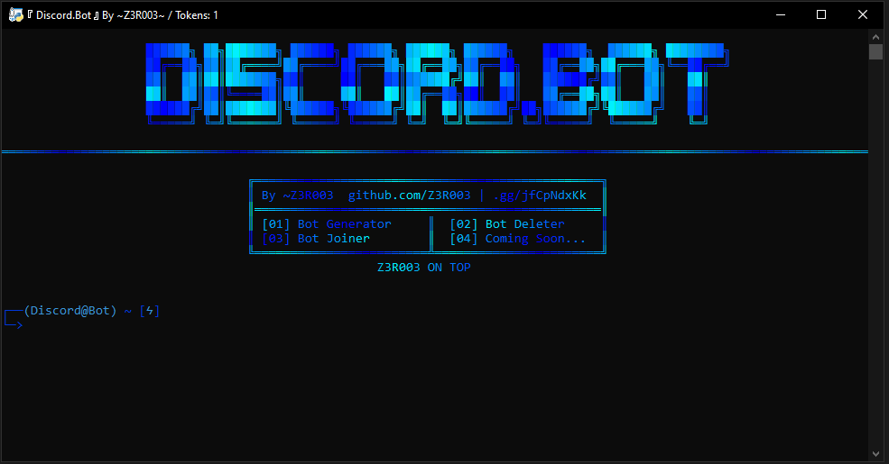

# 🚀Discord.Bot🚀
Discord.Bot is a tool f! Enjoy and do not forget to give it a star. https://discord.gg/jfCpNdxKk
## 📹 Preview

## 🔥 Features
```
✔ Discord Bot Generator
✔ Discord Bot Deleter
✔ Discord Bot Joiner
✔ Saves Bot Token and The OAuth2 Link in different txt file
✔ Multi Threading
✔ Free Or Paid Proxies
✔ Easy To Setup & Very Fast
```
## ✍️・Setup
1. Add your proxies in `proxies.txt`
2. Update `config.json` as you want
3. Add accounts tokens you have in `tokenss.txt`
3. Open `main.py`

## 📄・License
This project is licensed under the GPL General Public License v3.0 License
```js
  ・Educational purpose only and all your consequences caused by you actions is your responsibility
  ・Selling this Free gen is forbidden
  ・If you make a copy of this/or fork it, it must be open-source and have credits linking to this repo
```
## ⚠️ DISCLAIMER / WARNING 
This github repository is only for EDUCATIONAL PURPOSES ONLY. I am NOT under any responsibility if anything happens to you.

## ❓ Questions / Issues?
- Contact me on Discord: z3r003
- Discord Server: https://discord.gg/jfCpNdxKk
